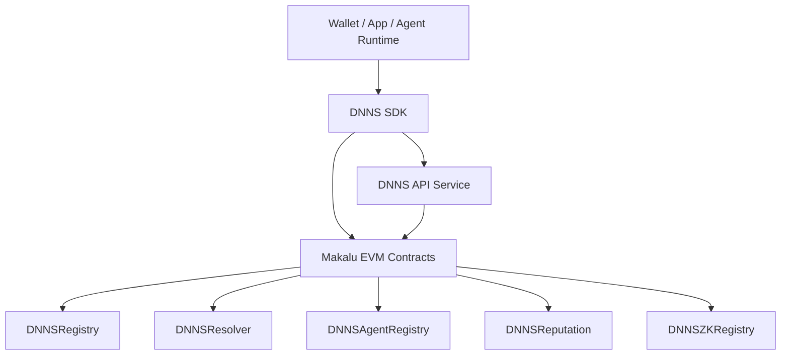
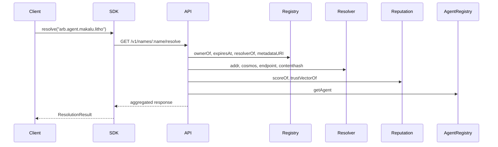

# DNNS Architecture Overview

Author: J. King Kasr  
Maintained by: KaJ Labs

## Goals

DNNS provides identity, naming, resolution, agent discovery, and reputation infrastructure for Lithosphere Web4 workloads.

## Components

## Flow: Resolve a name

## Storage model

| Component | Key | Value |
|---|---|---|
| Registry | `bytes32 node` | owner, resolver, expiry, metadata URI |
| Resolver | `bytes32 node` | EVM/Cosmos/content/API/text records |
| Agent registry | `bytes32 node` | agent descriptor, stake, commitment |
| Reputation | `bytes32 node` | score and trust vector |
| zk registry | `bytes32 node` | commitment, schema, nullifier usage |

## Security notes

- The API is read-focused by default.
- Ownership enforcement is handled on-chain.
- Reputation uses trusted reporter accounts until decentralized attestation is enabled.
- zk proofs require a production verifier and audited circuits before launch.
